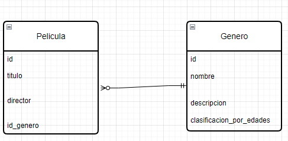

# TPE2024-WEB2
WEB2

Ferioli, Nicolas Adrian (feriolinicolas@gmail.com) | D'Annunzio, Benjamín (dannunzio98@gmail.com)
Base de datos de Peliculas con sus autores y sus respectivos generos.

Posee dos tablas:
  **PRIMER TABLA**: Peliculas (ID, Titulo, Autor, Año, ID_genero [clave foránea]).
  **SEGUNDA TABLA**: Generos (ID, Nombre, Descripción, Clasificacion por edad).
  
Las tablas tiene una relacion 1 a N (N=Peliculas), es decir, un género puede relacionarse a muchas peliculas (o ninguna), y una pelicula relacionarse a un solo género.

